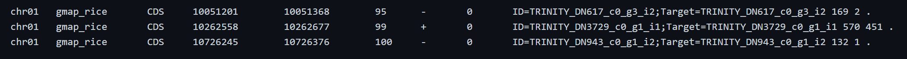
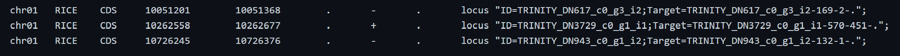

# from_GFF3_to_GTF
A simple Linux script to obtain a file.gtf from a file.gff3

This script was essential to my to apply the programe Telescope. The change in the format is perform just with Linux bash commands.

An example of the desire **input format** is:

An example of the output applying my scritp is the next one. This new file format do not produce errors in Telescope.

